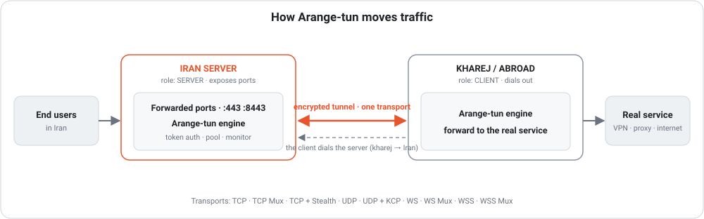
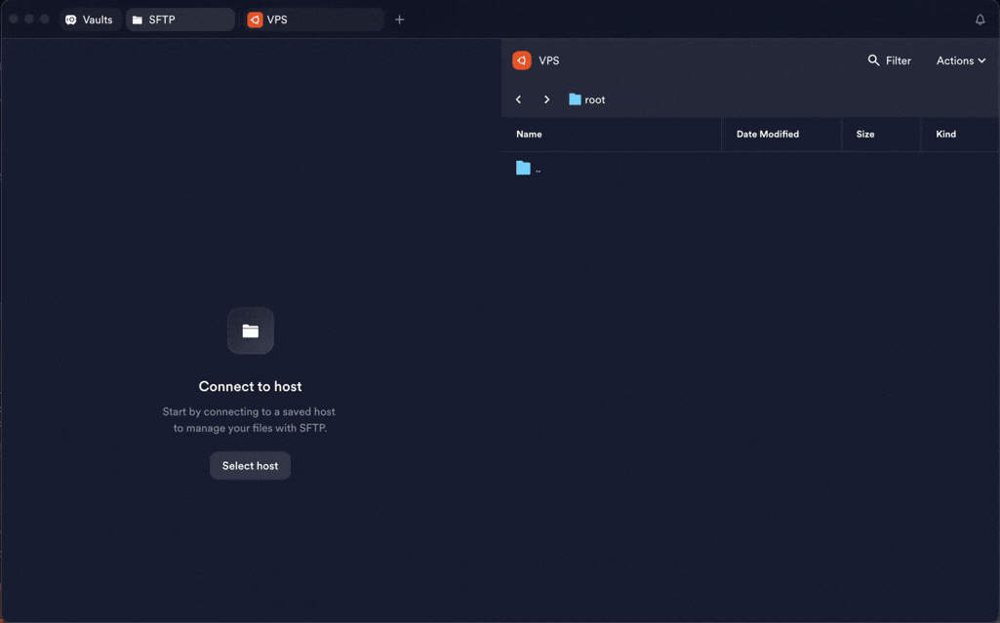
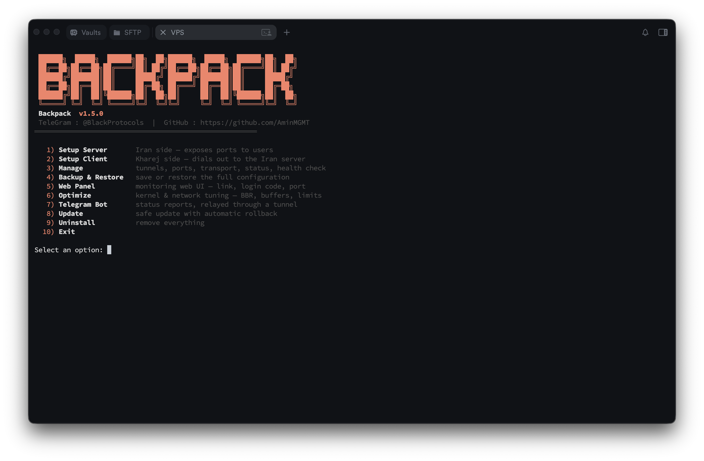
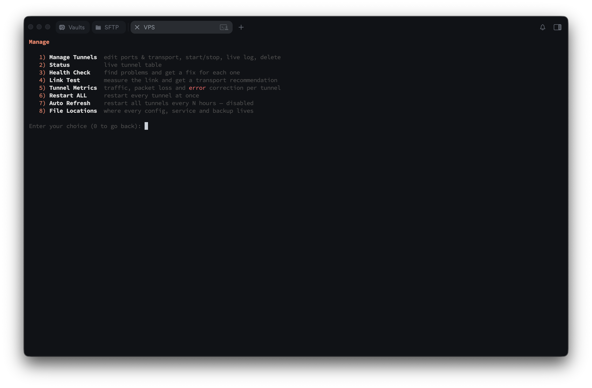

<p align="center"></p>

# Arange-tun 🎒

<p align="center">
  <a href="go.mod"></a>
  <a href="https://github.com/mahdi-byte64/Arange-tun/releases/latest"></a>
  <a href="LICENSE"></a>
  <a href="https://github.com/mahdi-byte64/Arange-tun/stargazers"></a>
  <a href="https://github.com/mahdi-byte64/Arange-tun/releases"></a>
</p>

**Arange-tun** is a high-performance **reverse tunnel** engine written entirely in
**Go**, purpose-built for Iran ⇄ abroad (kharej) server setups. It ships as a
single self-contained binary with an interactive CLI **and** a secured web
dashboard — so you can run and manage everything with or without a terminal.

> 📖 **[راهنمای فارسی (Persian) — README_FA.md](README_FA.md)**
>
> Telegram: **[@BlackProtocols](https://t.me/BlackProtocols)**

---

## Architecture

<p align="center"></p>

An end user connects to a **forwarded port** on the Iran server; the engine
carries it through **one transport** to the kharej client, which forwards it to
the **real service**. The tunnel is always dialed **by the client**
(kharej → Iran), so the far side needs no open inbound port.

---

## Why Arange-tun?

- **Multi-transport** — nine transports across TCP, UDP and WebSocket, so you
  match the route instead of fighting it.
- **Automatic rollback** — an update or edit that breaks a tunnel reverts itself,
  so you are never left with a dead tunnel.
- **Link Test** — measures your actual route and recommends the transport that
  suits it, with the timers to match.
- **Stealth** — a Noise-encrypted transport with **no fingerprint**; on the wire
  it looks like random bytes, so there is nothing to detect.
- **Chrome TLS fingerprint** — WSS dials with a real browser handshake, so the
  tunnel blends into ordinary HTTPS rather than standing out as a Go program.
- **Telegram relay** — status and alerts reach Telegram **from Iran** by going
  out through a tunnel peer; it even picks the tunnel for you.
- **Offline installer** — install or update a server with **no internet at all**;
  copy one archive over and go.
- **Self-healing watchdog** — a dropped tunnel is restarted within ~1 minute by a
  service that runs on its own, independent of the web panel.

---

## Install

One command as root on the VPS — it downloads the prebuilt **release tar.gz**
for your architecture (amd64/arm64) into **`/root/Arange-tun`**, verifies it
against the checksum published with the release, and installs the binary:

```bash
bash <(curl -fsSL https://raw.githubusercontent.com/mahdi-byte64/Arange-tun/main/install.sh)
```

It **opens the menu automatically** when it finishes. Later, reopen it any time
with:

```bash
sudo arange-tun
```

Everything lives in a tidy layout: the release bundle in `/root/Arange-tun`,
backups in `/root/Arange-tun/backups`, tunnel configs in `/etc/arange-tun`.

> **Building from source** still works as a fallback: clone the repo and run
> `sudo bash install.sh` inside it. If the release download fails it builds with
> Go, fetching modules **directly first** and via Iran-friendly mirrors
> (RunFlare, goproxy.cn) only when direct access fails.

### Offline install (server cannot reach GitHub)

Download the release on any machine **with** internet, copy it to the server,
and install it there. Nothing is fetched from the VPS.



From the [releases page](https://github.com/mahdi-byte64/Arange-tun/releases/latest),
download the archive for the server's architecture — run `uname -m` on it:
`x86_64` → `arange-tun_linux_amd64.tar.gz`, `aarch64` → `arange-tun_linux_arm64.tar.gz`.

**With the installer** (recommended — it also records the layout for the
uninstaller). Download `install.sh` and `SHA256SUMS` alongside the archive, put
all three in the **same folder** on the VPS, and run it. It finds the local
archive, verifies it against `SHA256SUMS`, and never touches the network:

```bash
scp install.sh SHA256SUMS arange-tun_linux_amd64.tar.gz root@SERVER_IP:/root/
ssh root@SERVER_IP "cd /root && sudo bash install.sh"
```

**By hand**, if you would rather not run a script. Upload the archive to the
server, then as root:

```bash
sha256sum arange-tun_linux_amd64.tar.gz        # compare against SHA256SUMS
tar xzf arange-tun_linux_amd64.tar.gz
mkdir -p /etc/arange-tun /root/Arange-tun/backups
install -m 0755 arange-tun /usr/local/bin/arange-tun
echo /root/Arange-tun > /etc/arange-tun/install_path
sudo arange-tun
```

The `install_path` line is what the built-in uninstaller reads to know what to
remove; skip it and everything still runs, but uninstalling has to be done by
hand. `install -m 0755` already sets the executable bit, so no `chmod` is needed
after it.

> **Updating offline** works the same way: repeat these steps with the newer
> archive. `install` replaces the binary in place, and your tunnels in
> `/etc/arange-tun` are untouched. Restart them afterwards with
> `sudo arange-tun` → *Restart ALL*.

---

## Quick start

**Get the roles right first** — this is the one thing people trip on:

| Server | Where | Menu option | Why |
|--------|-------|-------------|-----|
| **Iran server** | entry point | **Setup Server** | It exposes the ports; users connect to the **Iran IP** (fast, unfiltered for local users). |
| **Abroad (kharej)** | exit / origin | **Setup Client** | It dials the Iran server and forwards traffic to the real service (VPN panel, etc.). |

```
   end users ──▶  Iran server (SERVER, exposes ports)  ──tunnel──▶  Kharej (CLIENT, real service)
```

**Always set up the Iran server (Server) first**, then the abroad server
(Client) — the client needs the Iran address and the token the server generates.

### 1) On the Iran server — create the Server tunnel

```bash
sudo arange-tun   →  1. Setup Server
```

Pick the transport family (TCP / UDP / WebSocket) and then the variant, the
tunnel port and the exposed ports, accept the suggested **64-character token**
(press Enter), and choose a performance preset — **Turbo** is the recommended
default. Copy the token; you'll need it on the client.

### 2) On the abroad (kharej) server — create the Client tunnel

```bash
sudo arange-tun   →  2. Setup Client
```

Enter the **Iran server IP**, the tunnel port and the **same token**. Done.

---

## Features

**Transports** — TCP, TCP Mux, TCP + Stealth, UDP, UDP + KCP, WS, WS Mux,
WSS and WSS Mux, with connection pooling.

- **TCP + Stealth** — a TCP tunnel wrapped in a Noise layer with **no
  fingerprint**; on the wire it looks like random bytes, so there is nothing for
  deep packet inspection to match. Best where filtering is heavy.
  [Learn more →](docs/transports.md)
- **UDP + KCP** — reliable delivery with **forward error correction** over UDP,
  repairing packet loss without waiting for a retransmit.
  [Learn more →](docs/transports.md)
- **WSS / WSS Mux** — TLS with a real **Chrome fingerprint** and a **Let's
  Encrypt** (or self-signed) certificate; the credential is **bound to the TLS
  session**, not sent. And a **decoy site** answers every non-tunnel probe with
  an ordinary web page, so the server looks like a normal HTTPS website.
  [Learn more →](docs/transports.md)

**Every transport explained → [docs/transports.md](docs/transports.md)**

> **Filtered or dirty server?** If a foreign (kharej) server's connection is
> DPI-filtered, **TCP + Stealth** or **WSS** get the tunnel through — proven in
> the field, where a filtered Germany server came back online on Stealth. An IP
> blocked at the network layer, or a "dirty" exit, is a clean-IP or CDN-edge
> matter, not a transport one — see
> [when a server is filtered or dirty](docs/filtered-or-dirty-ip.md).

**Performance**

- Three presets — **Balance**, **Turbo** (recommended) and **Aggressive** —
  tuning pools, socket buffers, receive windows and kernel settings (BBR + fq).
- **Link Test** measures the route (latency, jitter, loss) and recommends the
  transport that suits it, deriving the liveness timers from your real round trip.
- **Optimize** applies the kernel/network tuning on its own (BBR + fq, socket
  buffer ceilings, file-descriptor limits).

**Reliability**

- **Automatic failover** to backup server addresses when the main one is filtered,
  or **load balancing** across all of them at once.
- **Self-healing watchdog** restarts a dropped tunnel within ~1 minute, from
  its own service — monitoring keeps running with the web panel stopped.
- **Automatic rollback** — updates and edits revert themselves if the tunnel does
  not come back up.
- **systemd-managed** services that survive reboots and closed terminals.

**Security**

- **The token never travels in the clear on an encrypted transport.** Stealth
  and KCP derive their keys from it without sending it; WSS/WSS Mux bind the
  credential to the TLS session, so an active attacker that terminates the TLS
  cannot read or replay it. (Plain TCP/TCP Mux/WS send it as-is — use an
  encrypted transport on an untrusted path.)
- **PROXY Protocol v2** forwards each user's real IP, so per-user device limits
  in the panel behind the tunnel work.
- **Per-tunnel limits** on simultaneous connections and on throughput.
- Login-protected dashboard. Downloads are SHA-256 verified against the release,
  and **anything that cannot be verified is refused rather than installed**.

**Management**

- **Interactive CLI** for setup, editing ports / transport / preset, per-tunnel
  control, live logs and status — every option explains itself.
- **Setup checks the address you give it**, warning about a CDN in front of the
  server, or a domain whose AAAA record sends the tunnel over IPv6 — the reason a
  bare IP can work where its own domain does not.
- **CDN edge** — a client can reach the server through a CDN edge (e.g.
  Cloudflare) instead of the origin, so the server's own IP is not exposed.
- **JSON logging** (`log_format = "json"`) for feeding logs to a collector; the
  human-readable log stays the default.
- **Auto-refresh:** restart all tunnels every N hours.

**Monitoring**

- **Web dashboard (port 7777)** — dark UI matching the CLI, with live
  CPU/RAM/disk/traffic and per-tunnel status, ping and logs. Create tunnels
  (server or client, every transport and preset, with the same advanced tuning
  as the CLI), then restart or delete them — all from the dashboard. Backup,
  Telegram setup and the panel password live in Settings.
- **Metrics** — traffic and connections on every transport and, on KCP,
  retransmits, loss and packets repaired by FEC. Totals are kept across restarts.
- **Health Check** — tests the server, the panel and every tunnel, printing a fix
  under each problem.

**Updates** — the CLI and the Telegram bot tell you when a new version is out;
one click installs it, SHA-256 verified, downloaded direct from GitHub or through
a tunnel peer. No Go, no git. **Stable** or **beta**.

**Backup** — every tunnel, the panel password, Telegram settings, TLS certificates
and the schedule in one portable `.tar.gz`, from the CLI, the web panel or the bot.

**Telegram**

- **Alerts** when the processor, memory or disk crosses a threshold, a tunnel
  goes down or comes back, or **a new Arange-tun version is released** — with a
  recovery message for each.
- Status, system and backup on demand, as buttons or commands.
- It reaches Telegram through a tunnel peer, so it works from Iran where Telegram
  is blocked — **choosing the tunnel itself and moving to another when that one
  goes down**. A built-in diagnosis names the exact hop when it cannot get out.

---

## Documentation

Each item has its own page under [`docs/`](docs/) — click through for the detail.

**Setup & management**
- **[The CLI menu](docs/cli-menu.md)** — every option, at a glance
- **[Failover & load balancing](docs/failover-load-balancing.md)** — backup server addresses
- **[Per-tunnel limits](docs/limits.md)** — cap connections and throughput
- **[Server layout](docs/server-layout.md)** — where every file lives

**Transports & performance**
- **[Transports](docs/transports.md)** — every transport explained
- **[Decoy site (WSS camouflage)](docs/camouflage.md)** — looks like a real website
- **[When a server is filtered or dirty](docs/filtered-or-dirty-ip.md)** — what to do
- **[Choosing a transport](docs/choosing-a-transport.md)** — Link Test and what to pick
- **[Performance presets](docs/performance-presets.md)** — Balance / Turbo / Aggressive
- **[Real client IP](docs/real-client-ip.md)** — PROXY protocol v2

**Monitoring**
- **[Web panel](docs/web-panel.md)** — the port-7777 dashboard
- **[Telegram bot](docs/telegram-bot.md)** — reports and control from Iran
- **[Alerts](docs/alerts.md)** — get told when something needs attention
- **[Tunnel Metrics](docs/tunnel-metrics.md)** — traffic, loss and FEC repairs
- **[Health Check](docs/health-check.md)** — find problems, get a fix
- **[Monitor service](docs/monitor-service.md)** — watchdog that runs on its own

**Maintenance**
- **[Backup & restore](docs/backup-restore.md)** — the whole config in one file
- **[Updates & rollback](docs/updates.md)** — verified updates, automatic rollback

---

## Screenshots

| CLI menu | Web panel |
|----------|-----------|
|  |  |

| Tunnel management | Telegram bot |
|-------------------|--------------|
|  |  |

---

## Support & donate

If Arange-tun helps you, a star or a small tip is appreciated. 🙏

- Telegram channel: **[@BlackProtocols](https://t.me/BlackProtocols)**

| Coin | Address |
|------|---------|
| **Tron (TRX)** | `TTzuUAtsEsrLgNpFVLNTyLVJVRRFNWESYc` |
| **USDT (BEP20)** | `0xc112AE9bfF7c59dEcFb34E988A397848D3093E82` |
| **Toncoin (TON)** | `UQD9g40QubAICJ6zPqegtCY7s-joMx2DB8aIqA0xF1aHoCDs` |

---

## License

**Copyright © 2026 Amin Mohammadi (mahdi-byte64).**
Released under the **GNU Affero General Public License v3.0 (AGPL-3.0)** — see
[LICENSE](LICENSE) and [NOTICE](NOTICE).
